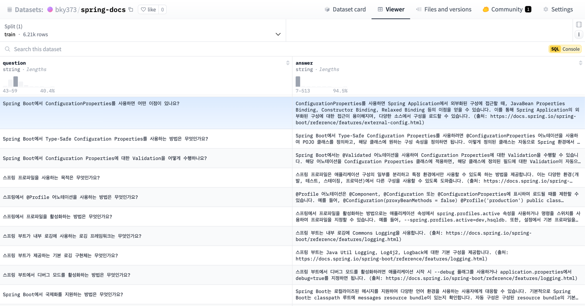

# Spring Assistant

### 목차

- [프로젝트 개요](#프로젝트-개요)
- [진행 방식](#진행-방식)
    - [기본 데이터 준비](#기본-데이터-준비)
    - [QA 데이터셋 생성](#QA-데이터셋-생성)
    - [파인 튜닝](#파인-튜닝)
    - [평가](#평가)
- [기대 효과](#기대-효과)
- [한계](#한계)
- [Sources](#sources)
- [References](#references)
- [License](#license)

## 프로젝트 개요

Spring Assistant는 자연어 질문을 통해 Spring 공식 문서에서 숨겨진 정보와 지엽적인 기능을 쉽게 찾을 수 있도록 돕는 AI 도우미입니다.
Spring의 다양한 기능과 설정이 때때로 문서 깊숙이 묻혀 있어 접근하기 어렵지만, 이 모델을 통해 개발자들이 보다 생산적이고 효율적으로 Spring을 활용할 수 있습니다.

## 작업 방식

### 기본 데이터 준비

Spring 생태계의 주요 프로젝트들을 포함한 대부분의 프로젝트 공식 문서 수집하였습니다. 접근 가능한 웹 페이지 수를 기준으로 2489 장의 문서를 수집하였습니다.

- 주요
  프로젝트: [Spring Boot](https://spring.io/projects/spring-boot), [Spring Framework](https://spring.io/projects/spring-framework), [Spring Data](https://spring.io/projects/spring-data), [Spring Cloud](https://spring.io/projects/spring-cloud), ..
- 왜 Spring 생태계의 다양한 프로젝트 문서를 수집해야 하나요?
    - Spring 생태계는 다양한 프로젝트로 구성되어 있어, 각 프로젝트의 문서를 포함함으로써 더 포괄적이고 정확한 정보를 제공할 수 있습니다.
      프로젝트 간의 연관성과 통합 방법에 대한 정보도 포함할 수 있어, 사용자에게 더 유용한 답변을 제공할 수 있습니다.

### QA 데이터셋 생성

수집된 공식 문서 내용을 Q&A 형식의 데이터셋으로 변환합니다. 데이터셋은
Upstage의 [solar-1-mini-chat](https://developers.upstage.ai/docs/getting-started/models) 모델(`버전: solar-1-mini-chat-240612`)을 사용하여 생성하였습니다.
결과적으로 아래 예시와 같이 6205 쌍의 QA 데이터셋을 만들었습니다.

- Dataset: https://huggingface.co/datasets/bky373/spring-docs
- Q&A 데이터셋으로 변환하는 것이 왜 유용한가요?
    - Q&A 형식은 사용자의 실제 질문 패턴과 유사하여, 모델이 더 자연스럽고 정확한 응답을 생성하는 데 도움이 됩니다.
      이 형식은 모델이 질문의 맥락을 이해하고 관련 정보를 추출하는 능력을 향상시킵니다.

### 파인 튜닝

사전 훈련된 `Gemma2-2b-it` 모델을 기반으로 QLoRA 방식을 사용하여 모델 파인튜닝을 진행하였습니다.

- 파인튜닝 모델: https://huggingface.co/datasets/bky373/spring-docs (변경 필요)
- 왜 QLoRA 방식으로 파인튜닝을 진행하나요?
    - QLoRA(Quantized Low-Rank Adaptation)는 적은 컴퓨팅 자원으로도 효과적인 파인튜닝이 가능한 기법입니다.
      모델의 대부분의 가중치를 고정하고 일부만 조정하여, 과적합 위험을 줄이면서도 특정 도메인에 대한 성능을 향상시킬 수 있습니다.

### 평가

파인 튜닝된 모델의 성능 변화를 확인합니다.

- (보류) 모델의 성능을 어떻게 평가할 수 있나요?
  테스트 데이터셋을 사용한 정량적 평가: 정확도, F1 점수, BLEU 점수 등의 메트릭을 활용
  인간 평가자를 통한 정성적 평가: 응답의 관련성, 정확성, 유용성 등을 평가
  기존 모델과의 비교 평가: 파인튜닝 전후의 성능 변화를 비교

## 한계

- Spring 문서 업데이트 주기가 빠르면, 최신 정보를 반영하는 데 시간이 걸릴 수 있습니다.
- 모델이 이해할 수 있는 문서 범위는 수집된 데이터셋의 범위에 따라 제한될 수 있습니다.

## 기대 효과

- Spring 개발자들이 자연어로 쉽게 정보를 검색하고 활용할 수 있는 환경을 만듭니다.
- 숨겨진 기능이나 지엽적인 설정 정보에도 쉽게 접근 가능하게 합니다.
- Spring의 모범 사례 빠르게 학습하고 적용할 수 있도록 합니다.
- 개발 생산성 및 코드 품질 향상에 기여합니다.

## Sources

- **Hugging Face**
    - [google/gemma-2-2b-it](https://huggingface.co/google/gemma-2-2b-it)
- **Spring Docs**
    - [Spring Boot](https://spring.io/projects/spring-boot)
    - [Spring Framework](https://spring.io/projects/spring-framework)
    - [Spring Data](https://spring.io/projects/spring-data)
    - [Spring Cloud](https://spring.io/projects/spring-cloud)
    - [Spring Security](https://spring.io/projects/spring-security)
    - [Spring Authorization Server](https://spring.io/projects/spring-authorization-server)
    - [Spring for GraphQL](https://spring.io/projects/spring-graphql)
    - [Spring Integration](https://spring.io/projects/spring-integration)
    - [Spring Modulith](https://spring.io/projects/spring-modulith)
    - [Spring REST Docs](https://spring.io/projects/spring-restdocs)
    - [Spring AI](https://spring.io/projects/spring-ai)
    - [Spring Batch](https://spring.io/projects/spring-batch)
    - [Spring CLI](https://spring.io/projects/spring-cli)
    - [Spring AMAP](https://spring.io/projects/spring-amqp)
    - [Spring for Apache Kafka](https://spring.io/projects/spring-kafka)
    - [Spring LDAP](https://spring.io/projects/spring-ldap)
    - [Spring for Apache Pulsar](https://spring.io/projects/spring-pulsar)
    - [Spring Shell](https://spring.io/projects/spring-shell)
    - [Spring Vault](https://spring.io/projects/spring-vault)

## References

- [Sherlock Holmes Q&A with Gemma fine tuning](https://www.kaggle.com/code/lucamassaron/sherlock-holmes-q-a-with-gemma-fine-tuning)
- [Gemma 한국어 요약 모델 파인튜닝 빠르게 해보기](https://devocean.sk.com/blog/techBoardDetail.do?ID=165703&boardType=techBlog)

## License

- 이 프로젝트는 다음의 오픈 소스 라이선스를 따릅니다:
  - All Spring Projects: [Apache License 2.0](https://www.apache.org/licenses/LICENSE-2.0). Copyright © 2024 Broadcom. All Rights Reserved.
  - Gemma 2 Model: [Apache License 2.0](https://www.apache.org/licenses/LICENSE-2.0). Copyright 2024 Google LLC.
  - Hugging Face Transformers: [Apache License 2.0](https://www.apache.org/licenses/LICENSE-2.0).
